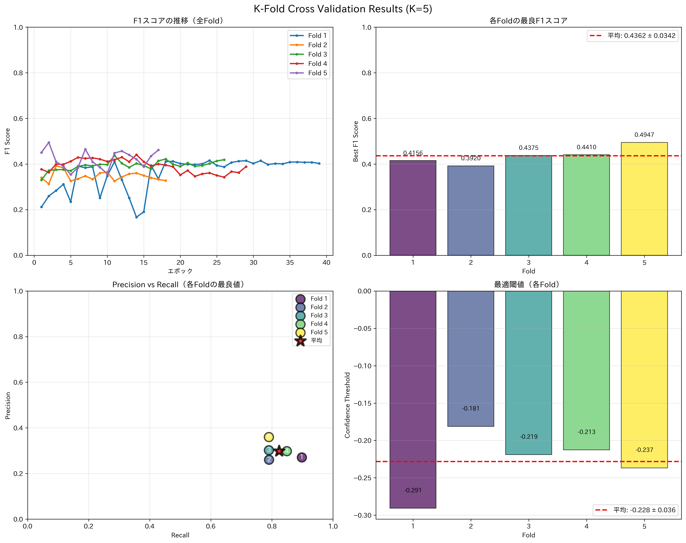
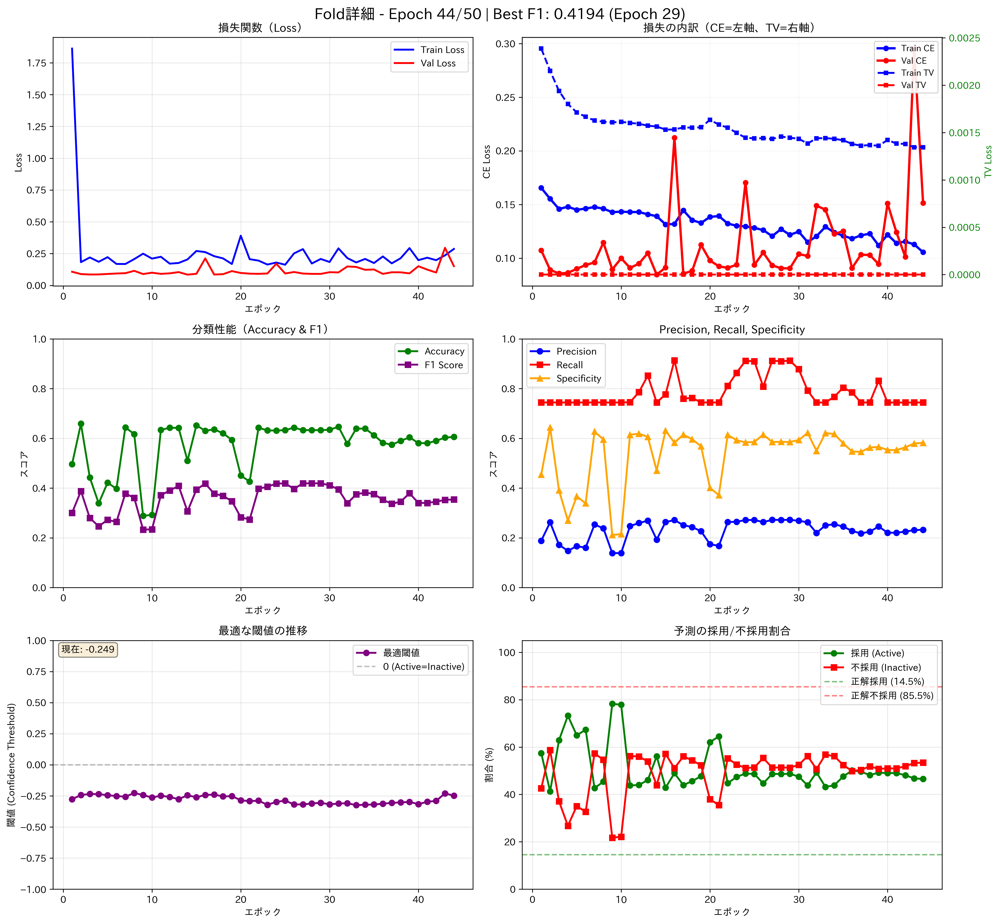

# 動画編集AI - 自動カット選択システム

動画から自動的に**最適なカット位置**を予測し、Premiere Pro用のXMLを生成するAIシステムです。

**想定用途**: 10分程度の動画を約2分（90秒〜150秒）のハイライト動画に自動編集

## 🎯 現在の開発フォーカス

**本プロジェクトは現在、カット選択（Cut Selection）に特化して開発中です。**

- ✅ **カット選択モデル**: 高精度で動作中（F1スコア: 0.5630）
- ⚠️ **グラフィック配置・テロップ生成**: 精度が低いため今後の課題
  - 現在のマルチモーダルモデル（音声・映像・トラック統合）は、グラフィック配置やテロップ生成の精度が実用レベルに達していません
  - カット選択に集中することで、より高品質な自動編集を実現します
  - グラフィック・テロップ機能は将来的に改善予定です

## 🎯 機能

### 現在実装済み（カット選択）
- **自動カット検出**: AIが最適なカット位置を予測（F1スコア: 0.5630）
- **音声同期カット**: 映像と音声を同じ位置で自動カット
- **クリップフィルタリング**: 短すぎるクリップの除外、ギャップ結合、優先順位付け
- **Premiere Pro連携**: 生成されたXMLをそのままPremiere Proで開ける
- **リアルタイム学習可視化**: 6つのグラフで学習状況を監視

### 将来的に実装予定の機能（精度改善後）
- **グラフィック配置の自動化**: キャラクター立ち絵の配置・スケール・位置調整
  - 現在のモデルでは精度が低く実用レベルに達していません
  - カット選択の精度向上を優先し、その後に取り組みます
- **AI字幕生成**: 音声認識（Whisper）と感情検出による自動字幕生成
- **テロップ自動配置**: OCRで検出したテロップのXML出力
  - Base64エンコード形式の解析が必要
- **動的な解像度対応**: 入力動画に応じた自動シーケンス設定

## 📁 プロジェクト構造

```
xmlai/
├── src/                          # ソースコード
│   ├── data_preparation/         # データ準備
│   ├── model/                    # モデル定義
│   ├── training/                 # 学習
│   ├── inference/                # 推論
│   └── utils/                    # ユーティリティ
├── scripts/                      # 補助スクリプト
├── tests/                        # テストコード
├── configs/                      # 設定ファイル
├── docs/                         # ドキュメント
├── data/                         # データ（.gitignoreで除外）
├── checkpoints/                  # 学習済みモデル（.gitignoreで除外）
├── preprocessed_data/            # 前処理済みデータ（.gitignoreで除外）
├── outputs/                      # 出力ファイル
├── archive/                      # アーカイブ（.gitignoreで除外）
└── backups/                      # バックアップ（.gitignoreで除外）
```

## 🚀 クイックスタート

### 必要な環境
- **OS**: Windows（バッチファイルを使用）
  - Mac/Linuxの場合は、Pythonコマンドを直接実行してください
- **Python**: 3.8以上
- **GPU**: CUDA対応GPU（推奨）
- **Premiere Pro**: XML読み込み用
- **⚠️ 重要**: プロジェクトパスに日本語などの非ASCII文字を含めないでください
  - MediaPipeが正常に動作しない可能性があります
  - 推奨: `C:\projects\xmlai` のようなASCII文字のみのパス

### インストール
```bash
pip install -r requirements.txt
```

**注意**: `requirements.txt`には動作確認済みのバージョンがコメントで記載されています。最小バージョン要件を満たしていれば、より新しいバージョンでも動作する可能性があります。

### 新しい動画を自動編集

**方法1: バッチファイルを使う（推奨）**
```bash
run_inference.bat "path\to\your_video.mp4"
```

**方法2: 手動で実行**
```bash
# 推論実行
python -m src.inference.inference_pipeline "your_video.mp4" outputs/inference_results/output.xml

# Premiere Proで output.xml を開く
```

詳しくは [QUICK_START.md](docs/QUICK_START.md) を参照してください。

## 📚 ドキュメント

### 基本ガイド
- [クイックスタート](docs/QUICK_START.md)
- [K-Fold Cross Validation](docs/K_FOLD_CROSS_VALIDATION.md)
- [プロジェクト全体の流れ](docs/guides/PROJECT_WORKFLOW_GUIDE.md)
- [必要なファイル一覧](docs/guides/REQUIRED_FILES_BY_PHASE.md)
- [音声カット & テロップ変換](docs/summaries/AUDIO_CUT_AND_TELOP_GRAPHICS_SUMMARY.md)

## 🔧 開発

### データ準備
```bash
# カット選択用データの作成
python scripts/create_cut_selection_data.py
```

### 学習

**カット選択モデルのトレーニング:**
```bash
# 1. データ準備（動画単位で分割）
python scripts/create_cut_selection_data.py

# 2. トレーニング実行（可視化付き）
train_cut_selection.bat

# 3. 学習状況の確認
# ブラウザで checkpoints_cut_selection/view_training.html を開く
# 2秒ごとに自動更新されるグラフで学習の様子をリアルタイム確認
```

**K-Fold Cross Validation（より信頼性の高い評価）:**
```bash
# 1. データ準備（train + valを結合）
python scripts/create_combined_data_for_kfold.py

# 2. K-Fold学習実行（5分割）
train_cut_selection_kfold.bat

# 3. 結果の確認
# checkpoints_cut_selection_kfold/kfold_comparison.png - 全Foldの比較
# checkpoints_cut_selection_kfold/kfold_summary.csv - 統計サマリー
```

### テスト
```bash
# カット選択モデルのテストは今後実装予定
```

## 📊 性能

### カット選択モデル（Cut Selection Model）
- **学習データ**: 94本の動画から218,693フレーム
  - 68本の動画を301シーケンスに分割（シーケンス長1000フレーム、オーバーラップ500）
  - **K-Fold Cross Validation**: 5分割で評価（GroupKFoldでデータリーク防止）
  - 同じ動画のシーケンスは必ず同じFoldに配置
- **採用率**: 全体23.34%（データセット全体）
- **想定入力**: 10分程度の動画
- **出力**: 約2分（90秒〜150秒）のハイライト動画
- **学習時間**: 50エポック × 5 Folds = 250エポック（約5-10時間、GPU使用時）
- **推論時間**: 5~10分/動画（特徴量抽出含む）
- **カット数**: 約8〜12個のクリップ（最小3秒、ギャップ結合・優先順位付け後）
- **モデル性能（K-Fold Cross Validation）**: 
  - **Mean F1 Score**: 0.4427 ± 0.0451
  - **Mean Recall**: 0.7230 ± 0.1418（採用の72%を検出、目標: 60-80%）✅
  - **Mean Precision**: 0.3310 ± 0.0552（予測の33%が正解、目標: 30-60%）✅
  - **Mean Accuracy**: 0.5855 ± 0.1008
  - **Optimal Threshold**: -0.235 ± 0.103（学習時に自動計算）
  - Focal Loss使用（alpha=0.75、gamma=3.0）
  - Class Weights: Active 3x, Inactive 3x（両方のエラーに同等のペナルティ）

#### K-Fold Cross Validation結果

**全Fold比較（F1スコア、精度、Precision vs Recall、最適閾値分布）:**



**Fold 1の詳細な学習状況（6つのグラフ）:**



各グラフの説明：
- **左上**: 損失関数の推移（Train/Val Loss）
- **右上**: 損失の内訳（CE Loss vs TV Loss、左軸=CE、右軸=TV）
- **中左**: 分類性能（Accuracy & F1 Score）
- **中右**: Precision, Recall, Specificity
- **下左**: 最適閾値の推移
- **下右**: 予測の採用/不採用割合

詳細な結果分析は [K-Fold Final Results](docs/K_FOLD_FINAL_RESULTS.md) を参照してください。

## ⚠️ 既知の問題点・改善点

### 現在の問題点

#### 1. テロップ関連
- **テロップがBase64エンコードで特徴量に含められていない**
  - Premiere ProのBase64エンコード形式のため、テロップの内容や位置情報を学習に活用できていない
  - OCRで検出したテロップ情報が学習データに反映されていない
- **テロップのXML出力未対応**
  - 学習したテロップ情報をXMLに出力する機能が実装されていない
  - 現在はテロップ生成を無効化して対応（`configs/config_telop_generation.yaml`）

#### 2. 編集の自由度
- **単一トラック配置**
  - 現在は1つのトラックに全クリップが時系列順に配置される
  - 複数トラックへの分散配置は未実装（編集の自由度が低い）

#### 3. フレーム単位の回帰予測のジッター（将来の課題）
- **ScaleやPosition（x, y）の予測が不安定**
  - **注意**: この問題は現在のカット選択モデルには関係ありません（カット選択は2値分類のみ）
  - 将来的にグラフィック配置機能を実装する際の課題として記載
  - フレームごとに独立して予測するため、値が微妙に震える（ジッター）
  - 生成された動画で画像がガクガク震える現象が発生
  - **提案**:
    - 移動平均フィルタ（Moving Average）の適用
    - サビツキー・ゴーレイ・フィルタなどで数値を滑らかにする
    - キーフレーム補間を考慮した予測方法の検討
    - LSTMやGRUなど時系列を考慮したモデルの使用

#### 4. XMLパースの複雑さ
- **premiere_xml_parser.pyの制限**
  - 標準的なXML構造のみを想定
  - **対応できない構造**:
    - ネストされたシーケンス（Nested Sequence）
    - マルチカムクリップ
    - 複雑なエフェクトチェーン
  - **問題点**:
    - ネストされた構造内のクリップが無視される
    - 時間計算が正しく行えない可能性
  - **提案**:
    - 再帰的にネストを掘るロジックの実装
    - より堅牢なXMLパーサーの採用（例: OpenTimelineIO）

#### 5. シーケンス設定の未対応
- **Premiere Proのシーケンス設定が反映されない**
  - 解像度、フレームレート、アスペクト比などの設定が固定
  - 縦長動画（1080x1920）に対応しているが、他の解像度は未検証
  - **問題点**:
    - 異なる解像度の動画で正しく動作しない可能性
    - フレームレートの不一致による音ズレの可能性
  - **提案**:
    - 入力動画のメタデータから自動的にシーケンス設定を生成
    - 設定ファイルでシーケンス設定をカスタマイズ可能に

### 改善予定（優先度別）

#### 高優先度（残り）
- [ ] **テロップデコード**: Base64エンコードされたテロップをデコードして特徴量に含める
- [ ] **テロップのXML出力**: 学習したテロップ情報をXMLに出力する機能を実装
- [ ] **Asset ID管理の改善**: 特徴量ベースのマッチングまたは役割ベースのID管理
- [ ] **トラック配置改善**: 複数トラックに分散配置して編集しやすいXMLを生成

#### 中優先度（残り）
- [ ] **学習データの品質向上**: より多様な編集スタイルのデータを追加
- [ ] **XMLパーサーの強化**: ネストされたシーケンスやマルチカムクリップへの対応
- [ ] **特徴量抽出の高速化**: 並列処理の最適化
- [ ] **モデルの軽量化**: 推論速度の向上

#### 低優先度
- [ ] **ユニットテストの拡充**: カバレッジ向上
- [ ] **ドキュメントの充実化**: チュートリアルやFAQの追加
- [ ] **UIの追加**: GUIベースの設定・実行ツール

### 技術的負債

#### 未解決（機能面）
- **Base64形式の解析処理未実装**: Premiere ProのBase64エンコード形式の解析・デコード処理が必要
- **XMLパーサーの制限**: ネストされたシーケンスやマルチカムクリップに未対応
- **Asset ID管理の問題**: ファイル名ベースのID割り当てで汎用性がない
- **単一トラック配置の制限**: 複数トラック対応への改修が必要

#### 未解決（コード品質）
- **特徴量次元数の不一致**: コメントと実装が合致していない可能性（軽微）

### 設定ファイルによるカスタマイズ

推論パラメータは`configs/config_inference.yaml`で設定可能です：

```yaml
# クリップフィルタリング
clip_filtering:
  active_threshold: 0.29      # Active判定の閾値（学習時に自動最適化）
  min_clip_duration: 3.0      # 最小クリップ継続時間（秒）
  max_gap_duration: 2.0       # ギャップ結合の最大長（秒）
  target_duration: 90.0       # 目標合計時間（秒）
  max_duration: 150.0         # 最大合計時間（秒）

# 予測値の平滑化
smoothing:
  enabled: true               # 平滑化の有効/無効
  method: 'savgol'           # 手法: moving_average, savgol, ema
  window_size: 5             # ウィンドウサイズ
```

学習時の重み付けは`configs/config_multimodal_experiment.yaml`で設定：

```yaml
# クラス不均衡の自動調整
auto_balance_weights: true   # 自動的に最適な重みを計算

# Loss重み（auto_balance_weights=falseの場合に使用）
active_weight: 1.0
asset_weight: 1.0
scale_weight: 1.0
position_weight: 1.0
```

**想定される処理フロー**:
1. 10分（600秒）の動画を入力
2. モデルが重要なシーンを予測（Active確率）
3. ギャップ結合で短い不採用区間を埋める
4. 3秒未満のクリップを除外
5. 予測値を平滑化（ジッター軽減）
6. スコア（確信度）順に並べて上位を選択
7. 合計90秒（最大150秒）のハイライト動画を生成

## 🤝 貢献

プルリクエストを歓迎します！特に以下の分野での貢献を募集しています：
- 学習データの提供
- パフォーマンス最適化
- ドキュメントの改善
- バグ修正

## 📝 ライセンス

MIT License


